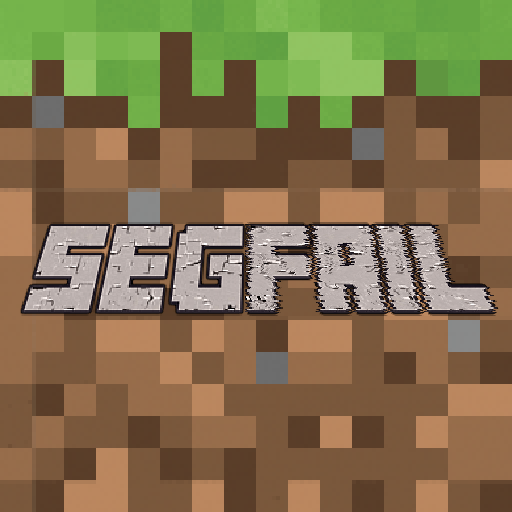

# segfail_mod

Peregovorka Minecraft mod



## Additions to the game

### Copper armor

| Icon                                                                         | Name              | Protection |
| ---------------------------------------------------------------------------- | ----------------- | ------- |
|       | Copper Helmet     | 2 |
|   | Copper Chestplate | 5 |
|      | Copper Leggins    | 4 |
|        | Copper Boots      | 2 |

### Copper items

All have durability of 200 and are slightly worse in mining speed/damage than their iron counterparts.
Copper Pickaxe mines same blocks as Iron Pickaxe.

| Icon                                                                     | Name           |
| -------------------------------------------------------------------------| ---------------|
|    | Copper Sword   |
|      | Copper Axe     |
|   | Copper Shovel  |
|  | Copper Pickaxe |
|      | Copper Hoe     |

## Dev setup

### Generate JB Intellij Idea project with decompiled MC sources

```bash
./gradlew.bat genSources idea
```

### Build .jar locally

```bash
./gradlew.bat build
```